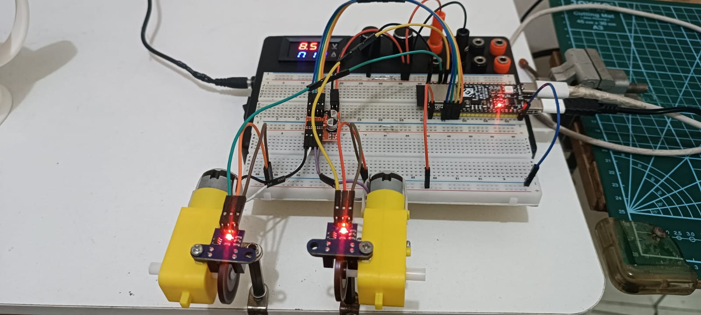

# Motor Control Code for BMC Makers Meetup #2
 

> This repository contains the code used for motor control demonstrations at the BMC Makers Meetup #2. The code is designed to interface with various motor drivers and control motors using different techniques.

   

- Schematics : 

- Pinout :
    - Motor Driver ([[MX1508 - Tokopedia Link]](https://www.tokopedia.com/arttechno/module-l298n-mini-dc-motor-driver-stepper))
        - MOTOR A 1 -> Pin 7
        - MOTOR A 2 -> Pin 6  
        - MOTOR B 1 -> Pin 5
        - MOTOR B 2 -> Pin 4

    - MCU : 
        - ESP32 S3 DevkitC ( *working example* )
        - or, ESP32 DevkitC ( *need pin adjustment* )
    - Speed Encoder [[OEM - Tokopedia Link]](https://www.tokopedia.com/arttechno/sensor-speed-motor-arduino-uno-mega-raspberry-pi-1729649446727682229)
        - VCC -> 3.3V
        - GND -> GND
        - MOTOR A PULSE ENCODER -> Pin 2
        - MOTOR B PULSE ENCODER -> Pin 1

    